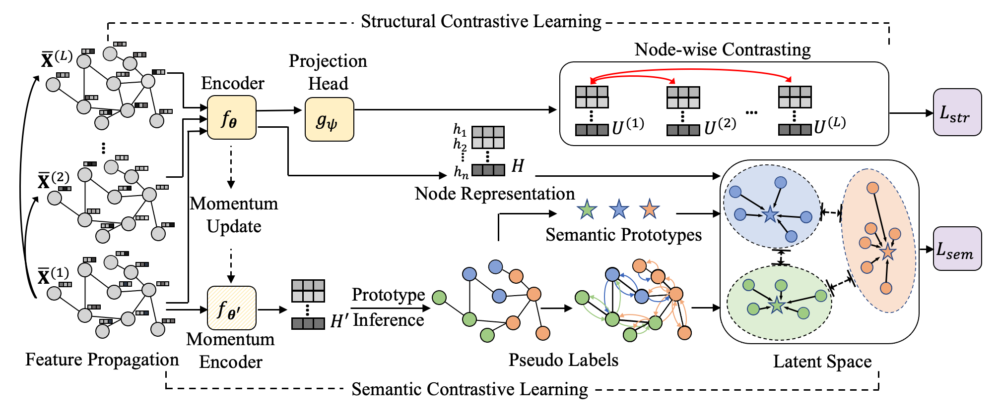

# S-3-CL
PyTorch Implementation for ["Eliciting Structural and Semantic Global Knowledge in Unsupervised Graph Contrastive Learning"](https://arxiv.org/pdf/2202.08480.pdf). (AAAI2023)

## Description
Graph Contrastive Learning (GCL) has recently drawn much research interest for learning generalizable node representations in a self-supervised manner. In general, the contrastive learning process in GCL is performed on top of the representations learned by a graph neural network (GNN) backbone, which transforms and propagates the node contextual information based on its local neighborhoods. However, nodes sharing similar characteristics may not always be geographically close, which poses a great challenge for unsupervised GCL efforts due to their inherent limitations in capturing such global graph knowledge. In this work, we address those inherent limitations by proposing a simple yet effective framework -- Simple Neural Networks with Structural and Semantic Contrastive Learning (S$^3$-CL). Notably, by virtue of the proposed structural and semantic contrastive learning algorithms, even a simple neural network can learn expressive node representations that preserve valuable global structural and semantic patterns. Our experiments demonstrate that the node representations learned by S$^3$-CL achieve superior performance on different downstream tasks compared with the state-of-the-art unsupervised GCL methods.



## Requirements
```
h5py==2.9.0
pandas==0.25.1
numpy==1.17.2
torch==1.7.0
torch-geometric==1.6.1
munkres==1.0.12
scipy==1.3.1
scikit_learn==0.22.1

```

## Usage
```
python train_proto.py
```

## Citation
If you use our code in your research, please cite the following article:
```
@inproceedings{ding2023structural,
  title={Eliciting Structural and Semantic Global Knowledge in Unsupervised Graph Contrastive Learning},
  author={Ding, Kaize and Wang, Yancheng and Yang, Yingzhen and Liu, Huan},
  booktitle={AAAI},
  year={2023}
}
```
